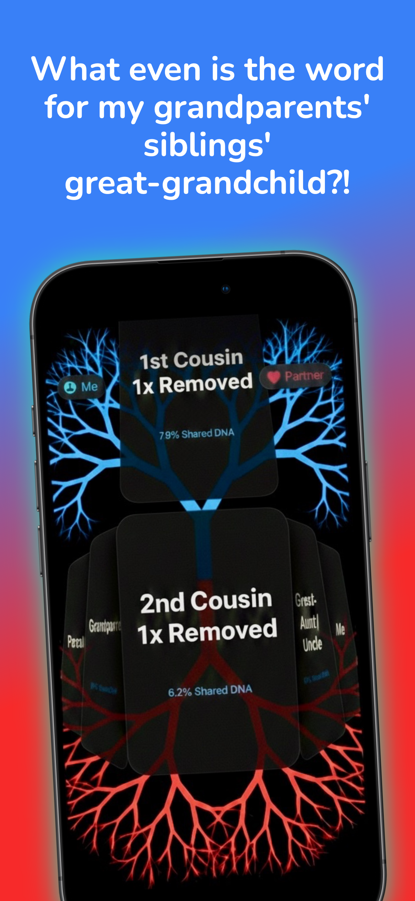
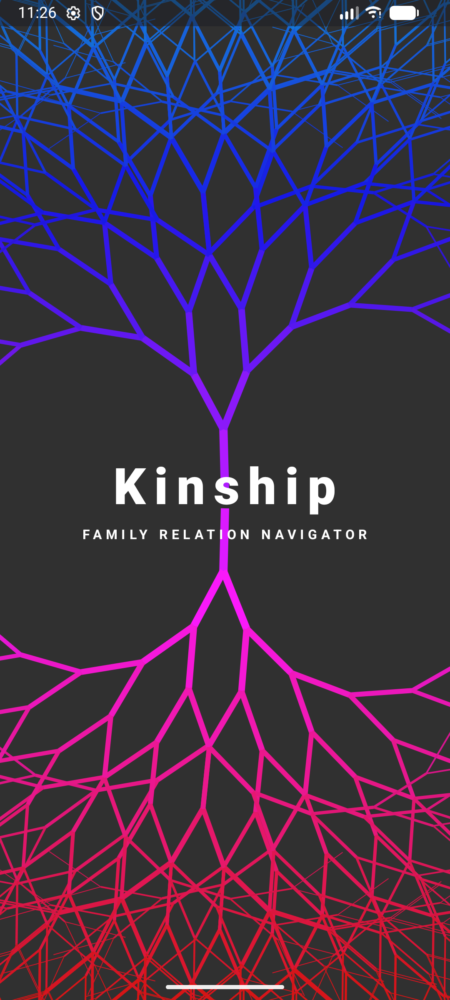

# KinshipRelations

**KinshipRelations** is an intuitive mobile application designed to help you master family terminology and understand your genetic connections. Using a unique "Liquid Glass" interface, the app allows you to swipe through complex generations—from your 1st cousin to your Great³-Grandchild—to find exactly how you are related and how much DNA you share.

---

## 📱 App Previews

  
  

---

## ✨ Features
* **Intuitive Swipe Navigation**: Explore your lineage with fluid, tactile gestures.
* **DNA Accuracy**: Instantly view the percentage of shared DNA for any relative.
* **Master Complex Terms**: Easily distinguish between "removed" cousins, "greats," and generational orders.
* **Blended Family Support**: Robust logic to handle step-relations and in-laws correctly.
* **Dynamic Visuals**: Features a growing fractal tree background that reacts as you navigate through your family history.

---

## 🛠️ Support
If you encounter any issues, have questions about family terminology, or would like to suggest a feature, please reach out to us. 

**Contact Email**: [parrottdev@icloud.com](mailto:parrottdev@icloud.com)

---

## 🔒 Privacy Policy
KinshipRelations values your privacy. 
* **Data Collection**: We do not collect personally identifiable information unless you voluntarily provide it for support purposes.
* **Local Processing**: Relationship logic and visuals are processed locally on your device.
* **Third Parties**: We do not sell or trade your data with third parties.

For a detailed look at our privacy practices, please contact us at the support email provided above.
